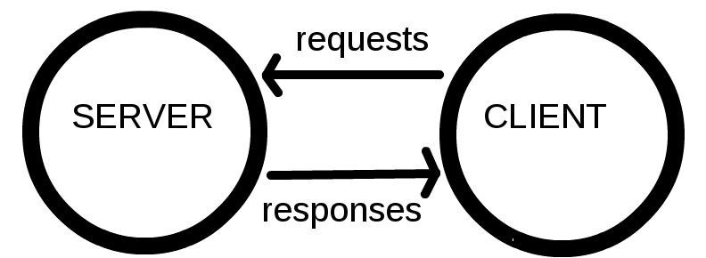
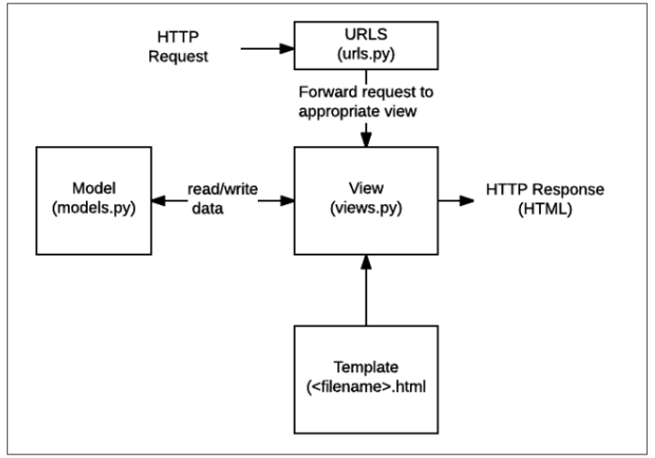

#  Django 시작하기

### Framework 이해하기 (1/3)

- 누군가 만들어 놓은 코드를 재사용 하는 것은 이미 익숙한 개발 문화
- 웹 서비스’도 누군가 개발해 놓은 코드를 재사용
- 전 세계의 수많은 개발자들이 이미 수없이 많이 개발해 봤고,  그 과정에서 자주 사용되는 부분들을 재사용 할 수 있게 좋은 구조의 코드로 만들어 뒀다.

### Framework 이해하기 (2/3)

- 코드들을 모아 놓은 것, 즉 서비스 개발에 필요한 기능들을 미리 구현해서 모아 놓은 것 = 프레임워크(Framework)
- Frame(뼈대, 틀) + Work(일하다)
  - 일정한 뼈대, 틀을 가지고 일하다
  - 제공받은 도구들과 뼈대, 규약을 가지고 무언가를 만드는 일
  - 특정 프로그램을 개발하기 위한 여러 도구들과 규약을 제공하는 것
- “소프트웨어 프레임워크”는 복잡한 문제를 해결하거나 서술하는 데 사용되는 기본 개념 구조

### Framework 이해하기 (3/3)

- 따라서, Framework를 잘 사용하기만 하면 웹 서비스 개발에 있어서 모든 것들을 하나부터 열까지 직접 개발할 필요 없이, 내가 만들고자 하는 본질(로직)에 집중해 개발할 수 있음
- 소프트웨어의 생산성과 품질을 높임

### 여러가지 Web Framework

- 웹 서비스를 만들 수 있는 다양한 프레임워크
- 2020년 Github Star 수 기준 인기 프레임워크 순위

### Django를 배워야하는 이유

- Python으로 작성된 프레임워크
  - Python이라는 언어의 강력함과 거대한 커뮤니티
- 수많은 여러 유용한 기능들
- 검증된 웹 프레임워크
  - 화해, Toss, 두나무, 당근 마켓, 요기요 등
  - 유명한 많은 서비스들이 사용한다는 것 == 안정적으로 서비스를 할 수 있다는 검증

# Web 이해하기

### 인터넷이란?

- 검색사이트 접속( ex) 네이버, 구글)
- 웹 브라우저를 켠고, 주소창에 주소를 입력한다.
- www, 즉 World Wide Web은 ‘전 세계에 퍼져 있는 거미줄 같은 연결망'

### 연결 되어 있는 세계

- 우리가 구글 홈페이지에 접속할 수 있는 이유는,  구글 본사 컴퓨터와 우리의 컴퓨터 간의 통신이 연결 되어 있기 때문이다.
- 전세계는 아주 두껍고 튼튼한 해저케이블로 연결 되어있음
- 해양 생물로 인해 문제가 생긴다면 인터넷이 잠시 느려지거나, 마비가 될 수 있음
- 전세계는 촘촘하고 거대한 유선으로 연결 되어있고,  이러한 연결로 부터 시작해 아주 많은 전봇대를 거쳐 우리집으로 인터넷이 연결됨
- 유선 연결은 한계가 있다.
  - 히말라야 정상이나, 아마존 밀림까지 케이블을 까는 것은 매우 어려운 일
  - 오지가 아니어도 개발 도상국 같은 나라에서는 충분한 인프라를 기대하기 어려움
  - “정보의 빈곤”

- 전세계의 컴퓨터가 연결되어 있는 하나의 인프라를 이용하는 것

# 클라이언트와 서버

### 클라이언트-서버 구조 (1/4)

- 오늘날 우리가 사용하는 대부분의 웹 서비스는 클라이언트-서버 구조를 기반으로 동작
- 클라이언트와 서버 역시 하나의 컴퓨터이며 이들이 어떻게 상호작용하는지에 대한 간소화된 다이어그램

### 클라이언트-서버 구조 (2/4)

- 클라이언트
  - 웹 사용자의 인터넷에 연결된 장치 (예를 들어 wi-fi에 연결된 컴퓨터 또는 모바일)
  - Chrome 또는 Firefox와 같은 웹 브라우저
  - 서비스를 요청하는 주체
- 서버
  - 웹 페이지, 사이트 또는 앱을 저장하는 컴퓨터
  - 클라이언트가 웹 페이지에 접근하려고 할 때 서버에서 클라이언트 컴퓨터로 웹 페이지 데이터를 응답해 사용자의 웹 브라우저에 표시됨
  - 요청에 대해 서비스를 응답하는 주체

### 클라이언트-서버 구조 (3/4)

- 상호작용 예시
  - 결론적으로 인터넷에 연결된 전세계 어딘가에 있는 구글 컴퓨터에게 ‘Google 홈페이지.html’ 파일을 달라고 요청하는 것
  - 그러면 구글 컴퓨터는 우리의 요청을 받고 ‘Google 홈페이지.html’ 파일을 인터넷을 통해서 우리 컴퓨터에게 응답해줌
  - 그렇게 전달받은 Google 홈페이지.html 파일을 웹 브라우저가 우리가 볼 수 있도록 해석해주는 것

### 클라이언트-서버 구조 (4/4)

- 여기서 ‘Google 홈페이지.html’을 달라고 요청한 컴퓨터, 웹 브라우저를 클라이언트 라고 하고 ‘Google 홈페이지.html’ 파일을 제공한 컴퓨터, 프로그램을 서버라고 함
- 어떠한 자원(resource)를 달라고 요청(request)하는 쪽을 클라이언트라고 하고 자원을 제공해주는 쪽을 서버(server)라고 함

# Django 구조 이해하기 (MTV Design Pattern)

### 소프트웨어 디자인 패턴

- 소프트웨어도 수십년간 전 세계의 개발자들이 계속 만들다 보니 자주 사용되는 구조와 해결책이 있다는 것을 알게 됨
- 앞서 배웠던 클라이언트-서버 구조도 소프트웨어 디자인 패턴 중 하나
- 자주 사용되는 소프트웨어의 구조를 소수의 뛰어난 엔지니어가 마치 건축의 공법처럼 일반적인 구조화를 해둔 것

### 소프트웨어 디자인 패턴의 목적

- 특정 문맥에서 공통적으로 발생하는 문제에 대해 재사용 가능한 해결책을 제시
- 프로그래머가 어플리케이션이나 시스템을 디자인할 때 발생하는 공통된 문제들을 해결하는데 형식화 된 가장 좋은 관행

### 소프트웨어 디자인 패턴의 장점

- 디자인 패턴을 알고 있다면 서로 복잡한 커뮤니케이션이 매우 간단해짐
- 다수의 엔지니어들이 일반화된 패턴으로 소프트웨어 개발을 할 수 있도록 한 규칙,  커뮤니케이션의 효율성을 높이는 기법

### Django에서의 디자인 패턴

- Django에도 이러한 디자인 패턴이 적용이 되어 있는데,  Django에 적용된 디자인 패턴은 MTV 패턴이다.
- MTV 패턴은 MVC 디자인 패턴을 기반으로 조금 변형된 패턴이다.

### MVC 소프트웨어 디자인 패턴

- MVC는 Model - View – Controller의 준말 데이터 및 논리 제어를 구현하는데 널리 사용되는 소프트웨어 디자인 패턴
- 하나의 큰 프로그램을 세가지 역할로 구분한 개발 방법론
- Model : 데이터와 관련된 로직을 관리
- View : 레이아웃과 화면을 처리
- Controller : 명령을 model과 view 부분으로 연결

### MVC 소프트웨어 디자인 패턴의 목적

- “관심사 분리”
- 더 나은 업무의 분리와 향상된 관리를 제공
- 각 부분을 독립적으로 개발할 수 있어, 하나를 수정하고 싶을 때 모두 건들지 않아도 됨
  - 개발 효율성 및 유지보수가 쉬워짐
  - 다수의 멤버로 개발하기 용이함

### Django에서의 디자인 패턴

- Django는 MVC 패턴을 기반으로 한 MTV 패턴을 사용 두 패턴은 서로 크게 다른 점은 없으며 일부 역할에 대해 부르는 이름이 다름

|    MVC     |   MTV    |
| :--------: | :------: |
|   Model    |  Model   |
|    View    | Template |
| Controller |   View   |

​	

### MTV 디자인 패턴

- Model
  - MVC 패턴에서 Model의 역할에 해당
  - 데이터와 관련된 로직을 관리
  - 응용프로그램의 데이터 구조를 정의하고 데이터베이스의 기록을 관리
- Template
  - 레이아웃과 화면을 처리
  - 화면상의 사용자 인터페이스 구조와 레이아웃을 정의
  - MVC 패턴에서 View의 역할에 해당
- View
  - Model & Template과 관련한 로직을 처리해서 응답을 반환
  - 클라이언트의 요청에 대해 처리를 분기하는 역할
  - 동작 예시
    - 데이터가 필요하다면 model에 접근해서 데이터를 가져오고 가져온 데이터를 template로 보내 화면을 구성하고 구성된 화면을 응답으로 만들어 클라이언트에게 반환
  - MVC 패턴에서 Controller의 역할에 해당

### 정리

- Django는 MTV 디자인 패턴을 가지고 있음
  - Model : 데이터 관련
  - Template : 화면 관련
  - View : Model & Template 중간 처리 및 응답 반환

