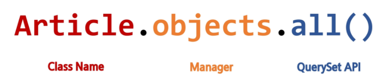

# Namespace

### 개요

- 개체를 구분할 수 있는 범위를 나타내는 namespace(이름 공간)에 대한 이해

### Namespace의 필요성

- 두번째 app pages의 index 페이지를 작성해보고 어떤 문제가 발생하는지 확인해보기

```python
# pages/urls.py

from django.urls import path
from . import views

urlpatterns = [
	path('index/', views.index, name='index'),
]
```

```python
# pages/views.py • Namespace의 필요성

def index(request):
	return render(request, 'index.html')
```

```html
<!-- pages/templates/index.html -->

 
<h1>두번째 앱의 index</h1>

```

```html
<!-- articles/templates/index.html -->

 
<h1>만나서 반가워요!</h1>
<a href="">greeting</a>
<a href="">dinner</a>
<a href="">throw</a>

<a href="">두번째 앱 index로 이동</a>

```

- 2가지 문제가 발생..

1. articles app index 페이지에 작성한 두번째 앱 index로 이동하는 하이퍼 링크를 클 릭 시 현재 페이지로 다시 이동

   - URL namespace

2. pages app의 index url (http://127.0.0.1:8000/pages/index/)로 직접 이동해도 articles app의 index 페이지가 출력됨

- Template namespace

# URL namespace

### 개요

- URL namespace를 사용하면 서로 다른 앱에서 동일한 URL 이름을 사용하는 경우에도 이름이 지정된 URL을 고유하게 사용 할 수 있음
- app_name attribute를 작성해 URL namespace를 설정

```python
# articles/urls.py

app_name = 'articles'
urlpatterns = [
	...,
]
```

```python
# pages/urls.py

app_name = 'pages'
urlpatterns = [
	...,
]
```

### URL tag의 변화

 ----> 

# Template namespace

### 개요

- Django는 기본적으로 app_name/templates/ 경로에 있는 templates 파일들만 찾 을 수 있으며, settings.py의 INSTALLED_APPS에 작성한 app 순서로 template을 검색 후 렌더링 함
- 바로 이 속성 값이 해당 경로를 활성화

```python
# settings.py

TEMPLATES = [
	{
		...,
		'APP_DIRS': True,
		...
	},
]
```

### 디렉토리 생성을 통해 물리적인 이름공간 구분

- Django templates의 기본 경로에 app과 같은 이름의 폴더를 생성해 폴더 구조를 app_name/templates/app_name/ 형태로 변경
- Django templates의 기본 경로 자체를 변경할 수는 없기 때문에 물리적으로 이름 공간을 만드는 것

```html
articles/ templates/ articles/ index.html ... pages/ templates/ pages/
index.html ...
```

### 템플릿 경로 변경

- 폴더 구조 변경 후 변경된 경로로 해당하는 모든 부분을 수정하기

```python
# articles/views.py

return render(request, 'articles/index.html')
```

```python
# pages/views.py

return render(request, 'pages/index.html')
```

### 반드시 Template namespace를 고려해야 할까?

- 만약 단일 앱으로만 이루어진 프로젝트라면 상관없음
- 여러 앱이 되었을 때에도 템플릿 파일 이름이 겹치지 않게 하면 되지만, 앱이 많아지면 대부분은 같은 이름의 템플릿 파일이 존재하기 마련

# Naming URL patterns

### Naming URL patterns의 필요성

- 만약 “index/”의 문자열 주소를 “new-index/”로 바꿔야 한다고 가정, 그렇다면 “index/” 주소를 사용했던 모든 곳을 찾아서 변경해야 하는 번거로움이 발생.

### Naming URL patterns

- 이제는 링크에 URL을 직접 작성하는 것이 아니라 “path()” 함수의 name 인자를 정의해서 사용
- DTL의 Tag 중 하나인 URL 태그를 사용해서 “path()” 함수에 작성한 name을 사용할 수 있음
- 이를 통해 URL 설정에 정의된 특정한 경로들의 의존성을 제거할 수 있음
- Django는 URL에 이름을 지정하는 방법을 제공함으로써 view 함수와 템플릿에서 특정 주소를 쉽게 참조할 수 있도록 도움

```python
# articles/urls.py

urlpatterns = [
	path('index/', views.index, name='index'),
	path('greeting/', views.greeting, name='greeting'),
	path('dinner/', views.dinner, name='dinner'),
	path('throw/', views.throw, name='throw'),
	path('catch/', views.catch, name='catch'),
	path('hello/<str:name>/', views.hello, name='hello'),
]
```

### Built-in tag – “url”

```html

```

- 주어진 URL 패턴 이름 및 선택적 매개 변수와 일치하는 절대 경로 주소를 반환
- 템플릿에 URL을 하드 코딩하지 않고도 DRY 원칙을 위반하지 않으면서 링크를 출력하는 방법

```html
<!-- catch.html -->

 
<h1>Catch</h1>
<h2>여기서 {{ message }}를 받았어!!</h2>
<a href="">다시 던지러</a>

```

```html
<!-- throw.html -->

 
<h1>Throw</h1>
<form action="" method="GET">...</form>

<a href="">뒤로</a>

```

```html
<!-- index.html -->

  ...
<a href="">greeting</a>
<a href="">dinner</a>
<a href="">throw</a>


<!-- dinner, greeting.html-->

<a href="">뒤로</a>
```

### url 태그 출력 확인하기

- 마지막으로 개발자 도구를 통해 url 태그가 URL 패턴 이름과 일치하는 절대 경로 주소를 반환하는 것을 확인해보기

### [참고] DRY 원칙

- Don’t Repeat Yourself의 약어
- 더 품질 좋은 코드를 작성하기 위해서 알고, 따르면 좋은 소프트웨어 원칙들 중 하나로 “소스 코드에서 동일한 코드를 반복하지 말자” 라는 의미
- 동일한 코드가 반복된다는 것은 잠재적인 버그의 위협을 증가 시키고 반복되는 코드를 변경해야 하는 경우, 반복되는 모든 코드를 찾아서 수정해야 함
- 이는 프로젝트 규모가 커질수록 애플리케이션의 유지 보수 비용이 커짐

### Django의 설계 철학 (Templates System)

1. “표현과 로직(view)을 분리”
   - 템플릿 시스템은 표현을 제어하는 도구이자 표현에 관련된 로직일 뿐
   - 즉, 템플릿 시스템은 이러한 기본 목표를 넘어서는 기능을 지원하지 말아야 함
2. “중복을 배제”
   - 대다수의 동적 웹사이트는 공통 header, footer, navbar 같은 사이트 공통 디자인을 갖음
   - Django 템플릿 시스템은 이러한 요소를 한 곳에 저장하기 쉽게 하여 중복 코드를 없애야 함
   - 템플릿 상속의 기초가 되는 철학

### Framework의 성격

- 독선적(Opinionated)
  - 독선적인 프레임워크들은 어떤 특정 작업을 다루는 ‘올바른 방법’에 대한 분명한 의견(규약)을 가지고 있음
  - 대체로 특정 문제내에서 빠른 개발방법을 제시
  - 어떤 작업에 대한 올바른 방법이란 보통 잘 알려져 있고 문서화가 잘 되어있기 때문
  - 하지만 주요 상황을 벗어난 문제에 대해서는 그리 유연하지 못한 해결책을 제시할 수 있음
- 관용적(Unopinionated)
  - 관용적인 프레임워크들은 구성요소를 한데 붙여서 해결해야 한다거나 심지어 어떤 도구를 써야 한다는 '올바른 방법'에 대한 제약이 거의 없음
  - 이는 개발자들이 특정 작업을 완수하는데 가장 적절한 도구들을 이용할 수 있는 자유도가 높음
  - 하지만 개발자 스스로가 그 도구들을 찾아야 한다는 수고가 필요

### Django Framework의 성격

- '다소 독선적'
  - 양쪽 모두에게 최선의 결과를 준다고 강조
- 결국하고자 하는 말은 현대 개발에 있어서는 가장 중요한 것들 중 하나는 '생산성'
- 프레임워크는 우리가 하는 개발을 방해하기 위해 규칙, 제약을 만들어 놓은 것이 아님
- 우리가 온전히 만들고자 하는 것에만 집중할 수 있게 도와주는 것
- "수레바퀴를 다시 만들지 말라"

# Database

### Database

- 체계화된 데이터의 모임
- 검색 및 구조화 같은 작업을 보다 쉽게 하기 위해 조직화된 데이터를 수집하는 저장 시스템

### Database 기본 구조

1. 스키마(Schema)
2. 테이블(Table)

### 스키마(Schema)

- 뼈대(Structure)
- 데이터베이스에서 자료의 구조, 표현 방법, 관계 등을 정의한 구조

| column | datatype |
| :----: | :------: |
|   id   |   INT    |
|  name  |   TEXT   |
|  age   |   INT    |
| email  |   TEXT   |

### 테이블(Table)

- 필드와 레코드를 사용해 조직된 데이터 요소들의 집합
- 관계(Relation)라고도 부름

1.  필드(field)

- 속성, 컬럼(Column)

2.  레코드(record)

- 튜플, 행(Row)

### 필드(field)

- 속성 혹은 컬럼(column)
- 각 필드에는 고유한 데이터 형식이 지정됨
  - INT, TEXT 등

### 레코드(record)

- 튜플 혹은 행(row)
- 테이블의 데이터는 레코드에 저장됨

### PK (Primary Key)

- 기본키
- 각 레코드의 고유한 값 (식별자로 사용)
- 기술적으로 다른 항목과 절대로 중복될 수 없는 단일 값(unique)
- 데이터베이스 관리 및 테이블 간 관계 설정 시 주요하게 활용 됨

- ex) 주민등록번호
  - 데이터베이스에 동일한 이름, 나이를 가진 사람들의 데이터는 존재할 수 있지만 각 사람들이 가진 주민등록번 호는 절대 같을 수 없음
  - 주민등록번호는 그 사람을 나타내는 고유한 값으로써 사용할 수 있음

### 쿼리(Query)

- 데이터를 조회하기 위한 명령어
- 조건에 맞는 데이터를 추출하거나 조작하는 명령어
  (주로 테이블형 자료구조에서 사용)
- "Query를 날린다." -----> "데이터베이스를 조작한다"

# Model

### 개요

- Django는 Model을 통해 데이터에 접근하고 조작
- 사용하는 데이터들의 필수적인 필드들과 동작들을 포함
- 저장된 데이터베이스의 구조 (layout)
- 일반적으로 각각의 모델은 하나의 데이터베이스 테이블에 매핑(mapping)
  - 모델 클래스 1개 == 데이터베이스 테이블 1개
- Model을 통해 데이터 관리

### [참고] 매핑

- Mapping
- 하나의 값을 다른 값으로 대응시키는 것

### Model 작성하기 (1/2)

- 새 프로젝트(crud), 앱(articles) 작성 및 앱 등록

```Git
$ django-admin startproject crud . [프로젝트 이름]

$ python manage.py startapp articles
```

```py
# settings.py

INSTALLED_APPS = [
	'articles',
	...
]
```

### Model 작성하기 (2/2)

- models.py 작성
  - 모델 클래스를 작성하는 것은 데이터베이스 테이블의 스키마를 정의하는 것
  - ”모델 클래스 == 테이블 스키마”

```python
# articles/models.py

class Article(models.Model):
	title = models.CharField(max_length=10)
	content = models.TextField()
```

### Model 이해하기 (1/4)

- 각 모델은 django.models.Model 클래스의 서브 클래스
  - 즉, 각 모델은 django.db.models 모듈의 Model 클래스를 상속받아 구성됨
  - 클래스 상속 기반 형태의 Django 프레임워크 개발
  - 프레임워크에서는 잘 만들어진 도구를 가져다가 잘 쓰는 것

```python
# articles/models.py

class Article(models.Model):
	title = models.CharField(max_length=10)
	content = models.TextField()
```

### Model 이해하기 (2/4)

- models 모듈을 통해 어떠한 타입의 DB 필드(컬럼)을 정의할 것인지 정의
  - Article에는 어떤 데이터 구조가 필요한지 정의
  - 클래스 변수 title과 content은 DB 필드를 나타냄

```python
# articles/models.py

class Article(models.Model):
	title = models.CharField(max_length=10)
	content = models.TextField()
```

### Model 이해하기 (3/4)

1. 클래스 변수(속성)명
   - DB 필드의 이름

```python
# articles/models.py

class Article(models.Model):
	title = models.CharField(max_length=10)
	content = models.TextField()
```

### Model 이해하기 (4/4)

2. 클래스 변수 값 (models 모듈의 Field 클래스)
   - DB 필드의 데이터 타입

### Django Model Field

- Django는 모델 필드를 통해 테이블의 필드(컬럼)에 저장할 데이터 유형 (INT, TEXT 등)을 정의
- 데이터 유형에 따라 다양한 모델 필드를 제공
  - DataField(), CharField(), IntegerField() 등
  - [[Model field reference | Django documentation | Django (djangoproject.com)](https://docs.djangoproject.com/en/3.2/ref/models/fields/)]

### 사용한 모델 필드 알아보기 (1/2)

- CharField(max_length=None, \*\*options)
  - 길이의 제한이 있는 문자열을 넣을 때 사용
  - max_length
    - 필드의 최대 길이(문자)
    - CharField의 필수 인자
    - 데이터베이스와 Django의 유효성 검사(값을 검증하는 것)에서 활용됨

### 사용한 모델 필드 알아보기 (2/2)

- TextField(\*\*options)
  - 글자의 수가 많을 때 사용
  - max_length 옵션 작성 시 사용자 입력 단계에서는 반영 되지만, 모델과 데이터베이스 단계에는 적용되지 않음 (CharField를 사용해야 함)
    - 실제로 저장될 때 길이에 대한 유효성을 검증하지 않음

### 데이터베이스 스키마

- 지금까지 작성한 models.py는 다음과 같은 데이터베이스 스키마를 정의한 것
- 이제 이러한 모델의 변경사항을 실제 데이터베이스에 반영하기 위한 과정이 필요

| Column  |  Data Type  |
| :-----: | :---------: |
|  title  | VARCHAR(10) |
| content |    TEXT     |

# Migrations

### Migrations 관련 주요 명령어

1. makemigrations
2. migrate

### makemigrations (1/2)

- 모델의 변경사항에 대한 새로운 migration을 만들 때 사용

```
$ python manage.py makemigrations
```

### makemigrations (2/2)

- 명령어 실행 후 migrations/0001_initial.py가 생성된 것을 확인
- "파이썬으로 작성된 설계도”

### migrate

- makemigrations로 만든 설계도를 실제 데이터베이스에 반영하는 과정
  (db.sqlite3 파일에 반영)
- 결과적으로 모델의 변경사항과 데이터베이스를 동기화

```
$ python manage.py migrate
```

- 설계도(migration)를 실제 db.sqlite3 DB 파일에 반영

### [참고] Migrations 기타 명령어

1. showmigrations

```
$ python manage.py showmigrations
```

- migrations 파일들이 migrate 됐는지 안됐는지 여부를 확인하는 용도
- [x] 표시가 있으면 migrate가 완료되었음을 의미

2. sqlmigrate

```
$ python manage.py sqlmigrate articles 0001
```

- 해당 migrations 파일이 SQL 문으로 어떻게 해석 될 지 미리 확인 할 수 있음

# 추가 필드 정의

### Model 변경사항 반영하기 (1/6)

- models.py에 변경사항이 생겼을 때 어떤 과정의 migration이 필요할까?
- 추가 모델 필드 작성 후 다시 한번 makemigrations 진행

```python
# articles/models.py

class Article(models.Model):
	title = models.CharField(max_length=10)
	content = models.TextField()
	created_at = models.DateTimeField(auto_now_add=True)
	updated_at = models.DateTimeField(auto_now=True)
```

```
$ python manage.py makemigrations
```

### Model 변경사항 반영하기 (2/6)

- 기존에 id, title, content 필드를 가진 테이블에 2개의 필드가 추가되는 상황
- Django 입장에서는 이미 존재하는 테이블에 새로운 컬럼이 추가되는 요구 사항을 받 았는데, 이러한 컬럼들은 기본적으로 빈 값을 갖고 추가될 수 없음
  - Django는 우리에게 추가되는 컬럼에 대한 기본 값을 설정해야 하니 어떤 값을 설정할 것인지를 물어보는 과정을 진행

```
You are trying to add the field 'created_at' with 'auto_now_add=True' to article without a default; the database needs
something to populate existing rows.

 1) Provide a one-off default now (will be set on all existing rows)
 2) Quit, and let me add a default in models.py
Select an option:
```

### Model 변경사항 반영하기 (3/6)

- 각 보기 번호의 의미
  1. 다음 화면으로 넘어가서 새 컬럼의 기본 값을 직접 입력하는 방법
  2. 현재 과정에서 나가고 모델 필드에 default 속성을 직접 작성하는 방법
- “1”을 입력 후 Enter (created_at 필드에 대한 default 값 설정)

```
You are trying to add the field 'created_at' with 'auto_now_add=True' to article without a default; the database needs
something to populate existing rows.

 1) Provide a one-off default now (will be set on all existing rows)
 2) Quit, and let me add a default in models.py
Select an option: 1
```

### Model 변경사항 반영하기 (4/6)

- 다음 화면에서 아무것도 입력하지 않고 Enter를 입력하면
  Django에서 기본적으로 파이썬의 timezone 모듈의 now 메서드 반환 값을
  기본 값으로 사용하도록 해줌

```
Please enter the default value now, as valid Python
You can accept the default 'timezone.now' by pressing 'Enter' or you can provide another value.
The datetime and django.utils.timezone modules are available, so you can do e.g. timezone.now
Type 'exit' to exit this prompt
[default: timezone.now] >>>
```

### Model 변경사항 반영하기 (5/6)

- 새로운 설계도(마이그레이션 파일)가 만들어 진 것을 확인

### Model 변경사항 반영하기 (6/6)

- 새로운 설계도를 생성했기 때문에 DB와 동기화를 진행해야 함
  (아직 DB에는 변경사항이 반영하지 않았기 때문)

```
$ python manage.py migrate
```

### DateTimeField()

- Python의 datetime.datetime 인스턴스로 표시되는 날짜 및 시간을 값으로 사용하는 필드
- DateField를 상속받는 클래스
- 선택 인자

1.  auto_now_add

- 최초 생성 일자 (Useful for creation of timestamps)
- 데이터가 실제로 만들어질 때 현재 날짜와 시간으로 자동으로 초기화 되도록 함

2.  auto_now

- 최종 수정 일자 (Useful for “last-modified” timestamps)
- 데이터가 수정될 때마다 현재 날짜와 시간으로 자동으로 갱신되도록 함

### 반드시 기억해야 할 migration 3단계

1.  models.py에서 변경사항이 발생하면
2.  migration 생성

- makemigrations

3.  DB 반영 (모델과 DB의 동기화)

- migrate

` 중간에 번역을 담당하는 것이 ORM`

# ORM

### 개요

- Object-Relational-Mapping
- 객체 지향 프로그래밍 언어를 사용하여 호환되지 않는 유형의 시스템 간에
  (Django <-> DB)데이터를 변환하는 프로그래밍 기술
- 객체 지향 프로그래밍에서 데이터베이스을 연동할 때, 데이터베이스와 객체 지향 프로그래밍 언어 간의 호환되지 않는 데이터를 변환하는 프로그래밍 기법
- Django는 내장 Django ORM을 사용
- 한 마디로 SQL을 사용하지 않고 데이터베이스를 조작할 수 있게 만들어주는 매개체

### ORM 예시


### ORM 장단점

- 장점
  - SQL을 잘 알지 못해도 객체지향 언어로 DB 조작이 가능
  - 객체 지향적 접근으로 인한 높은 생산성
- 단점
  - ORM 만으로 세밀한 데이터베이스 조작을 구현하기 어려운 경우가 있음

### ORM을 사용하는 이유

- “생산성”
- 현시대 개발에서 가장 중요한 키워드는 바로 생산성
- 우리는 DB를 객체(object)로 조작하기 위해 ORM을 사용할 것

# QuerySet API

### 외부 라이브러리 설치 및 설정

- 실습 편의를 위한 추가 라이브러리 설치 및 설정

```
$ pip install ipython
$ pip install django-extensions
```

```python
# settings.py

INSTALLED_APPS = [
'articles',
'django_extensions',
...,
]
```

- 패키지 목록 업데이트

```
$ pip freeze > requirements.txt
```

### [참고] IPython & django-extensions

- IPython
  - 파이썬 기본 쉘보다 더 강력한 파이썬 쉘
  - django-extensions
- django-extensions
  - Django 확장 프로그램 모음
  - shell_plus, graph model 등 다양한 확장 기능 제공

### [참고] Shell

- 운영체제 상에서 다양한 기능과 서비스를 구현하는 인터페이스를 제공하는 프로그램
- Shell(껍데기), 사용자와 운영 체제의 내부사이의 인터페이스를 감싸는 층이기 때문에 그러한 이름이 붙음
- “사용자 <–> 셸 <–> 운영체제”

### [참고] Python Shell

- 파이썬 코드를 실행해주는 인터프리터
  - 인터프리터 : 코드를 한 줄 씩 읽어 내려가며 실행하는 프로그램
- 인터렉티브 혹은 대화형 shell 이라고 부름
- Python 명령어를 실행하여 그 결과를 바로 제공

```
# git bash (windows)
$ python -i

# zsh (macOS)
$ python
```

### Django shell

- ORM 관련 구문 연습을 위해 파이썬 쉘 환경을 사용
- 다만 일반 파이썬 쉘을 통해서는 장고 프로젝트 환경에 영향을 줄 수 없기 때문에
  Django환경 안에서 진행할 수 있는 Django shell을 사용
- 원래는 다음과 같은 명령어를 통해 Django shell을 사용하지만

```
$ python manage.py shell
```

- django-extension이 제공하는 더 강력한 shell_plus로 진행

```
$ python manage.py shell_plus
```

```shell
• Django shell 실행
$ python manage.py shell_plus

# Shell Plus Model Imports
from articles.models import Article
from django.contrib.admin.models import LogEntry
from django.contrib.auth.models import Group, Permission, User
from django.contrib.contenttypes.models import ContentType
from django.contrib.sessions.models import Session
# Shell Plus Django Imports
from django.core.cache import cache
from django.conf import settings
from django.contrib.auth import get_user_model
from django.db import transaction
from django.db.models import Avg, Case, Count, F, Max, Min, Prefetch, Q, Sum, When
from django.utils import timezone
from django.urls import reverse
from django.db.models import Exists, OuterRef, Subquery
Python 3.9.13 (main, Aug 24 2022, 22:54:29)
Type 'copyright', 'credits' or 'license' for more information
IPython 8.4.0 -- An enhanced Interactive Python. Type '?' for help.

In [1]:
```

```shell
In [1]: Article.objects.all()
Out[1]: <QuerySet []>
```

### Database API

- Django가 제공하는 ORM을 사용해 데이터베이스를 조작하는 방법
- Model을 정의하면 데이터를 만들고 읽고 수정하고 지울 수 있는 API를 제공

### Database API 구문



### Objects manager

- Django 모델이 데이터베이스 쿼리 작업을 가능하게 하는 인터페이스
- Django는 기본적으로 모든 Django 모델 클래스에 대해 objects 라는 Manager 객체를 자동으로 추가함
- 이 Manager를 통해 특정 데이터를 조작할 수 있음
- DB를 Python class로 조작할 수 있도록 여러 메서드를 제공하는 manager

### Query

- 데이터베이스에 특정한 데이터를 보여 달라는 요청
  - “쿼리문을 작성한다.”
  - → 원하는 데이터를 얻기 위해 데이터베이스에 요청을 보낼 코드를 작성한다.
- 이 때, 파이썬으로 작성한 코드가 ORM의 의해 SQL로 변환되어 데이터베이스에 전달되며, 데이터베이스의 응답 데이터를 ORM이 QuerySet이라는 자료 형태로 변환하여 우리에게 전달

### QuerySet

- 데이터베이스에게서 전달 받은 객체 목록(데이터 모음)
  - 순회가 가능한 데이터로써 1개 이상의 데이터를 불러와 사용할 수 있음
- Django ORM을 통해 만들어진 자료형이며, 필터를 걸거나 정렬 등을 수행할 수 있음
- objects manager를 사용하여 복수의 데이터를 가져오는 queryset method를 사용 할 때 반환되는 객체
- 단, 데이터베이스가 단일한 객체를 반환 할 때는 QuerytSet이 아닌 모델(Class)의 인 스턴스로 반환됨

### QuerySet API

- QuerySet과 상호작용하기 위해 사용하는 도구 (메서드, 연산자 등)


# QuerySet API 익히기

- Queryset API를 활용해 데이터를 생성하고, 읽고, 수정하고 삭제해보기 (CRUD)

### CRUD

- Create / Read / Update / Delete (생성, 조회, 수정, 삭제)
- 대부분의 컴퓨터 소프트웨어가 가지는 기본적인 데이터 처리 기능 4가지를 묶어서 일컫는 말

# CREATE

### 데이터 객체를 만드는(생성하는) 3가지 방법

- 첫번째 방법

1.  article = Article()

- 클래스를 통한 인스턴스 생성

2.  article.title

- 클래스 변수명과 같은 이름의 인스턴스 변수를 생성 후 값 할당

3.  article.save()

- 인스턴스로 save 메서드 호출

### 첫번째 방법 (1/3)

```shell
# 특정 테이블에 새로운 행을 추가하여 데이터 추가

>>> article = Article() # Article(class)로부터 article(instance)
>>> article
<Article: Article object (None)>

>>> article.title = 'first' # 인스턴스 변수(title)에 값을 할당
>>> article.content = 'django!' # 인스턴스 변수(content)에 값을 할당

# save를 하지 않으면 아직 DB에 값이 저장되지 않음

>>> article
<Article: Article object (None)>

>>> Article.objects.all()
<QuerySet []>
```

### 첫번째 방법 (2/3)

- save 메서드를 호출해야 비로소 DB에 데이터가 저장된다. (레코드 생성)

```shell
# save를 하고 확인하면 저장된 것을 확인할 수 있다.

>>> article.save()
>>> article
<Article: Article object (1)>
>>> article.id
1
>>> article.pk
1
>>> Article.objects.all()
<QuerySet [Article: Article object (1)]
```

> DB 테이블의 컬럼 이름이 id 임에도 pk를 사용할 수 있는 이유는 Django가 제공하는 shortcut이기 때문

### 첫번째 방법 (3/3)

```shell
# 인스턴스인 article을 활용하여 변수에 접근해보자(데이터 저장된 것을 확인)

>>> article.title
'first'
>>> article.content
'django!'
>>> article.created_at
datetime.datetime(2022, 8, 21, 2, 43, 56, 49345, tzinfo=<UTC>)
```

### 두번째 방법

- 인스턴스 생성 시 초기 값을 함께 작성하여 생성

```shell
>>> article = Article(title='second', content='django!')

# 아직 저장 되어있지 않음
>>> article
<Article: Article object (None)>

# save를 호출해야 저장됨
>>> article.save()
>>> article
<Article: Article object (2)>
>>> Article.objects.all()
<QuerySet [<Article: Article object (1)>, <Article: Article object (2)>]>
```

```shell
# 값 확인
>>> article.pk
2
>>> article.title
'second'
>>> article.content
'django!’
```

### 세번째 방법

- QuerySet API 중 create() 메서드 활용

```shell
# 위 2가지 방식과는 다르게 바로 생성된 데이터가 반환된다.

>>> Article.objects.create(title='third', content='django!')
<Article: Article object (3)>
```

### .save()

- “Saving object”
- 객체를 데이터베이스에 저장함
- 데이터 생성 시 save를 호출하기 전에는 객체의 id 값은 None
  - id 값은 Django가 아니라 데이터베이스에서 계산되기 때문
- 단순히 모델 클래스를 통해 인스턴스를 생성하는 것은 DB에 영향을 미치지 않기 때문 에 반드시 save를 호출해야 테이블에 레코드가 생성됨

# READ

### 개요

- QuerySet API method를 사용해 데이터를 다양하게 조회하기
- QuerySet API method는 크게 2가지로 분류됨

      1.   Methods that “return new querysets”
      1.   Methods that “do not return querysets”

### all()

- QuerySet return
- 전체 데이터 조회

```shell
>>> Article.objects.all()
<QuerySet [<Article: Article object (1)>, <Article: Article object (2)>, <Article: Article object (3)>]>
```

### get()

- 단일 데이터 조회
- 객체를 찾을 수 없으면 DoesNotExist 예외를 발생시키고, 둘 이상의 객체를 찾으면 MultipleObjectsReturned 예외를 발생시킴
- 위와 같은 특징을 가지고 있기 때문에 primary key와 같이 고유성(uniqueness)을 보장하는 조회에서 사용해야 함

```shell
>>> Article.objects.get(pk=1)
<Article: Article object (1)>

>>> Article.objects.get(pk=100)
DoesNotExist: Article matching query does not exist.

>>> Article.objects.get(content='django!')
MultipleObjectsReturned: get() returned more than one Article -- it returned 2!
```

### filter()

- 지정된 조회 매개 변수와 일치하는 객체를 포함하는 새 QuerySet을 반환

```shell
>>> Article.objects.filter(content='django!')
<QuerySet [<Article: Article object (1)>, <Article: Article object (2)>, <Article: Article object (3)>]>

>>> Article.objects.filter(title='ssafy')
<QuerySet []>

>>> Article.objects.filter(title='first')
<QuerySet [<Article: Article object (1)>]>
```

> 조회된 객체가 없거나 1개여도 QuerySet을 반환

### Field lookups

- 특정 레코드에 대한 조건을 설정하는 방법
- QuerySet 메서드 filter(), exclude() 및 get()에 대한 키워드 인자로 지정됨
- 다양한 built-in lookups는 공식문서를 참고
- [[QuerySet API reference | Django documentation | Django (djangoproject.com)](https://docs.djangoproject.com/en/3.2/ref/models/querysets/#field-lookups)]

```shell
# Field lookups 예시

# "content 컬럼에 'dj'가 포함된 모든 데이터 조회"
Article.objects.filter(content__contains='dj')
```

# UPDATE

### Update 과정

- 수정하고자 하는 article 인스턴스 객체를 조회 후 반환 값을 저장
- article 인스턴스 객체의 인스턴스 변수 값을 새로운 값으로 할당
- save() 인스턴스 메서드 호출

```shell
>>> article = Article.objects.get(pk=1)
# 인스턴스 변수를 변경
>>> article.title = 'byebye'
# 저장
>>> article.save()
# 정상적으로 변경된 것을 확인
>>> article.title
'byebye'
```

# DELETE

### Delete 과정

- 삭제하고자 하는 article 인스턴스 객체를 조회 후 반환 값을 저장
- delete() 인스턴스 메서드 호출

```shell
>>> article = Article.objects.get(pk=1)

# delete 메서드 호출
>>> article.delete()
(1, {'articles.Article': 1})

# 1번 데이터는 이제 조회할 수 없음
>>> Article.objects.get(pk=1)
DoesNotExist: Article matching query does not exist.
```

# CRUD with view functions

### base 템플릿 작성

- bootstrap CDN 및 템플릿 추가 경로 작성

```html
<!-- templates/base.html -->

<!DOCTYPE html>
<html lang="en">
  <head>
    <meta charset="UTF-8" />
    <meta http-equiv="X-UA-Compatible" content="IE=edge" />
    <meta name="viewport" content="width=device-width, initial-scale=1.0" />
    <!-- bootstrap CSS CDN -->
    <title>Document</title>
  </head>
  <body>
    <div class="container"> </div>
    <!-- bootstrap JS CDN -->
  </body>
</html>
```

```py
# settings.py

'TEMPLATES = [
	{
		...,
		'DIRS': [BASE_DIR / 'templates',],
		...
]
```

- url 분리 및 연결

```python
# articles/urls.py

from django.urls import path


app_name = 'articles'
urlpatterns = [
]
```

```python
# crud/urls.py

from django.contrib import admin
from django.urls import path, include

urlpatterns = [
	path('admin/', admin.site.urls),
	path('articles/', include('articles.urls')),
]
```

```python
# articles/urls.py

from django.urls import path
from . import views

app_name = 'articles'
urlpatterns = [
	path('', views.index, name='index'),
]
```

```py
# articles/views.py

def index(request):
	return render(request, 'articles/index.html')
```

```html
<!-- templates/articles/index.html -->

 
<h1>Articles</h1>

```

# READ 1 (index page)

### 전체 게시글 조회

- index 페이지에서는 전체 게시글을 조회해서 출력한다.

```python
# articles/views.py

from .models import Article


def index(request):
	articles = Article.objects.all()
	context = {
		'articles': articles,
	}
	return render(request, 'articles/index.html', context)
```

```html
<!--templates/articles/index.html-->

 
<h1>Articles</h1>
<hr />

<p>글 번호: {{ article.pk }}</p>
<p>글 제목: {{ article.title }}</p>
<p>글 내용: {{ article.content }}</p>
<hr />
 
```

# CREATE

### 개요

- CREATE 로직을 구현하기 위해서는 몇 개의 view 함수가 필요할까?
  - 사용자의 입력을 받을 페이지를 렌더링 하는 함수 1개
  - “new” view function
- 사용자가 입력한 데이터를 전송 받아 DB에 저장하는 함수 1개
  - “create” view function

```py
# articles/urls.py

urlpatterns = [
	path('', views.index, name='index'),
	path('new/', views.new, name='new'),
]
```

```python
# articles/views.py

def new(request):
	return render(request, 'articles/new.html')
```

```html
<!-- templates/articles/new.html -->

 
<h1>NEW</h1>
<form action="#" method="GET">
  <label for="title">Title: </label>
  <input type="text" name="title" /><br />
  <label for="content">Content: </label>
  <textarea name="content"></textarea><br />
  <input type="submit" />
</form>
<hr />
<a href="">[back]</a>

```

### New

- new 페이지로 이동할 수 있는 하이퍼 링크 작성

```html
<!-- templates/articles/index.html -->

 
<h1>Articles</h1>
<a href="">NEW</a>
<hr />
... 
```

### Create (1/3)

```python
# articles/urls.py

urlpatterns = [
	...
	path('create/', views.create, name='create'),
]
```

```py
def create(request):
	title = request.GET.get('title')
	content = request.GET.get('content')

	# 1.
	# article = Article()
	# article.title = title
	# article.content = content
	# article.save()

	# 2.
	article = Article(title=title, content=content)
	article.save()

	# 3.
	# Article.objects.create(title=title, content=content)

	return render(request, 'articles/create.html')
```

> 데이터를 생성하는 3가지 방법

### Create (2/3)

- 게시글 작성 후 확인

```html
<!-- templates/articles/create.html -->

 
<h1>성공적으로 글이 작성되었습니다.</h1>

```

```html
<!-- templates/articles/new.html -->

 
<h1>NEW</h1>
<form action="" method="GET">
  <label for="title">Title: </label>
  <input type="text" name="title" /><br />
  <label for="content">Content: </label>
  <textarea name="content" cols="30" rows="5"></textarea><br />
  <input type="submit" />
</form>
<hr />
<a href="">[back]</a>

```

### Create (3/3)

- 게시글 작성 후 index 페이지로 돌아가도록 함

```python
# articles/views.py

def create(request):
	...
	return render(request, 'articles/index.html')
```

### Django shortcut function – “redirect()” (1/2)

- 인자에 작성된 곳으로 요청을 보냄
- 사용 가능한 인자

1.  view name (URL pattern name)

```python
return redirect('articles:index')
```

2. absolute or relative URL

```py
return redirect('/articles/')
```

### Django shortcut function – “redirect()” (2/2)

- 동작 확인 후 불필요해진 create.html는 삭제

```python
# articles/views.py

from django.shortcuts import render, redirect

def create(request):
	title = request.GET.get('title')
	content = request.GET.get('content')

	article = Article(title=title, content=content)
	article.save()

	# return redirect('/articles/')
	return redirect('articles:index')
```

### redirect 동작 이해하기 (1/2)

- 게시글 작성 후 터미널 로그 확인하기

```shell
[06/Jun/2022 18:43:37] "GET /articles/create/?title=11&content=22 HTTP/1.1" 302 0
[06/Jun/2022 18:43:37] "GET /articles/ HTTP/1.1" 200 1064
```

### redirect 동작 이해하기 (2/2)

- 동작 원리

1.  클라이언트가 create url로 요청을 보냄
2.  create view 함수의 redirect 함수가 302 status code를 응답
3.  응답 받은 브라우저는 redirect 인자에 담긴 주소(index)로
    사용자를 이동시키기 위해 index url로 Django에 재요청
4.  index page를 정상적으로 응답 받음 (200 status code)

### [참고] 302 Found

- HTTP response status code 중 하나
- 해당 상태 코드를 응답 받으면 브라우저는 사용자를 해당 URL의 페이지로 이동 시킴

### HTTP response status code

- 클라이언트에게 특정 HTTP 요청이 성공적으로 완료되었는지 여부를 알려줌
- 응답은 5개의 그룹으로 나뉘어짐

1.  Informational responses (1xx)
2.  Successful responses (2xx)
3.  Redirection messages (3xx)
4.  Client error responses (4xx)
5.  Server error responses (5xx)

### HTTP method GET 재검토

- 현재는 게시글이 작성될 때 /articles/create/?title=11&content=22 와 같은 URL로 요청이 보내짐
- GET은 쿼리 스트링 파라미터로 데이터를 보내기 때문에 url을 통해 데이터를 보냄
- 하지만 현재 요청은 데이터를 조회하는 것이 아닌 작성을 원하는 요청
- GET이 아닌 다른 HTTP method를 알아보기

### HTTP request method (1/3)

- HTTP는 request method를 정의하여, 주어진 리소스에 수행하길 원하는 행동을 나타냄

### HTTP request method (2/3)

- GET
  - 특정 리소스를 가져오도록 요청할 때 사용
  - 반드시 데이터를 가져올 때만 사용해야 함
  - DB에 변화를 주지 않음
  - CRUD에서 R 역할을 담당

# HTTP request method (3/3)

- POST
  - 서버로 데이터를 전송할 때 사용
  - 서버에 변경사항을 만듦
  - 리소스를 생성/변경하기 위해 데이터를 HTTP body에 담아 전송
  - GET의 쿼리 스트링 파라미터와 다르게 URL로 데이터를 보내지 않음
  - CRUD에서 C/U/D 역할을 담당

### POST method 적용하기 (1/5)

- 실제 네이버에서 로그인 부분을 확인해보기
- 로그인 부분에서 GET이 아닌 POST를 사용하고 있음

### POST method 적용하기 (2/5)

- 그럼 왜 검색에서는 GET을 사용할까?
  - 검색은 서버에 영향을 미치는 것이 아닌 특정 데이터를 조회만 하는 요청이기 때문
  - 특정 페이지를 조회하는 요청을 보내는 HTML의 a tag 또한 GET을 사용

### POST method 적용하기 (3/5)

- 코드를 변경하고 URL에서 쿼리 스트링 파라미터가 없어진 것을 확인해보기

```html
<!-- templates/articles/new.html -->

 
<h1 class="text-center">NEW</h1>
<form action="" method="POST">...</form>
<hr />
<a href="">[back]</a>

```

### POST method 적용하기 (4/5)

- 게시글 작성 후 서버로그 확인하기

```shell
Forbidden (CSRF cookie not set.): /articles/create/
[06/Jun/2022 19:27:28] "POST /articles/create/ HTTP/1.1" 403 2870
```

- 403 Forbidden 응답을 받았지만 이는 나중에 확인하고 요청된 URL(/articles/create/)을 확인
  - 개발자도구 - NETWORK 탭 – Payload 탭의 Form-Data 확인

### POST method 적용하기 (5/5)

- 데이터가 담긴 위치가 바뀌었기 때문에 view함수에서도 다음과 같이 수정 필요

```python
# articles/views.py

def create(request):
	title = request.POST.get('title')
	content = request.POST.get('content')

	article = Article(title=title, content=content)
	article.save()
	return render(request, 'articles/create.html')
```

### HTTP methods 정리

- GET은 단순히 조회하려는 경우 & POST는 서버나 DB에 변경을 요청하는 경우
- TMDB API나 다른 API 문서에서 봤던 요청 예시 문서에서 등장했던 친구들이 바로 HTTP methods 였음

### [참고] 403 Forbidden

- 서버에 요청이 전달되었지만, 권한 때문에 거절되었다는 것을 의미
- 서버에 요청은 도달했으나 서버가 접근을 거부할 때 반환됨
- 즉, 게시글을 작성할 권한이 없다
  → Django 입장에서는 “작성자가 누구인지 모르기 때문에 함부로 작성할 수 없다”라는 의미

- 모델(DB)을 조작하는 것은 단순 조회와 달리 최소한의 신원 확인이 필요하기 때문

### CSRF

- Cross-Site-Request-Forgery
- “사이트 간 요청 위조”
- 사용자가 자신의 의지와 무관하게 공격자가 의도한 행동을 하여 특정 웹 페이지를 보안에 취약하게 하거나 수정, 삭제 등의 작업을 하게 만드는 공격 방법
- 실제 사례 - “2008년 옥X 개인정보 해킹 사건”
  - 해커가 옥X 운영자에게 CSRF 코드가 포함된 가짜 사이트가 담긴 이메일을 보냄
  - 관리자는 해당 사이트에 정보를 입력하여 관련 정보가 해커에게 보내졌고, 해커는 옥X 사이트의 관리자 권한을 얻어냄 (당시 1860만건 유출)

### CSRF 공격 방어

- “Security Token 사용 방식 (CSRF Token)”
  - 사용자의 데이터에 임의의 난수 값(token)을 부여해 매 요청마다 해당 난수 값을 포함시켜 전송 시키도록 함
  - 이후 서버에서 요청을 받을 때마다 전달된 token 값이 유효한지 검증
  - 일반적으로 데이터 변경이 가능한 POST, PATCH, DELETE Method 등에 적용
  - Django는 DTL에서 csrf_token 템플릿 태그를 제공

### csrf_token 템플릿 태그 (1/2)

```html

```

- 해당 태그가 없다면 Django 서버는 요청에 대해 403 forbidden으로 응답
- 템플릿에서 내부 URL로 향하는 Post form을 사용하는 경우에 사용
  - 외부 URL로 향하는 POST form에 대해서는 CSRF 토큰이 유출되어 취약성을 유발할 수 있기 때문에 사용해서는 안됨

### csrf_token 템플릿 태그 (2/2)

- 태그 작성 후 확인하기
- input type이 hidden으로 작성되며 value는 Django에서 생성한 hash 값으로 설정

```html
<!-- templates/articles/new.html -->

 
<h1>NEW</h1>
<form action="" method="POST">
   ...
</form>
<hr />
<a href="">[back]</a>

```

### csrf_token 템플릿 태그 정리

- 마지막으로 게시글을 작성하고 문제없이 저장되는지 확인해보기
- "csrf_token 은 해당 POST 요청이 내가 보낸 것 인지를 검증하는것"

# READ 2 (detail page)

### 개요

- 개별 게시글 상세 페이지 제작
- 모든 게시글 마다 뷰 함수와 템플릿 파일을 만들 수는 없음
  - 글의 번호(PK)를 활용해서 하나의 뷰 함수와 템플릿 파일로 대응
- 무엇을 활용할 수 있을까?
  - Variable Routing

### urls

- URL로 특정 게시글을 조회할 수 있는 번호를 받음

```python
# articles/urls.py

urlpatterns = [
	...
	path('<int:pk>/', views.detail, name='detail'),
]
```

### views

- Article.objects.get(pk=pk)에서
  오른쪽 pk는 variable routing을 통해 받은 pk,
  왼쪽 pk는 DB에 저장된 레코드의 id 컬럼

```python
# articles/views.py

def detail(request, pk):
	article = Article.objects.get(pk=pk)
	context = {
		'article': article,
	}
	return render(request, 'articles/detail.html', context)
```

```html
<!--templates templates/articles/detail.html -->

 
<h2>DETAIL</h2>
<h3>{{ article.pk }} 번째 글</h3>
<hr />
<p>제목: {{ article.title }}</p>
<p>내용: {{ article.content }}</p>
<p>작성 시각: {{ article.created_at }}</p>
<p>수정 시각: {{ article.updated_at }}</p>
<hr />
<a href="">[back]</a>

```

```html
<!-- templates/articles/index.html -->

 
<h1>Articles</h1>
<a href="">[new]</a>
<hr />
 ...
<a href="">[detail]</a>
<hr />
 
```

- redirect 인자 변경

```python
# articles/views.py

def create(request):
	...
	return redirect('articles:detail', article.pk)
```

# DELETE

### urls

- 모든 글을 삭제 하는 것이 아니라 삭제하고자 하는 특정 글을 조회 후 삭제해야 함

```python
# articles/urls.py

urlpatterns = [
	...
	path('<int:pk>/delete/', views.delete, name='delete'),
```

### views

```python
# articles/views.py

def delete(request, pk):
	article = Article.objects.get(pk=pk)
	article.delete()
	return redirect('articles:index')
```

### templates

- Detail 페이지에 작성하며 DB에 영향을 미치기 때문에 POST method를 사용

```html
<!-- articles/detail.html -->

  ...
<form action="" method="POST">
  
  <input type="submit" value="DELETE" />
</form>
<a href="">[back]</a>

```
