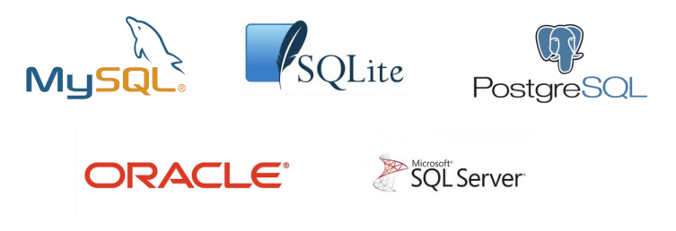

# 📌 Database

- 데이터베이스는 체계화된 데이터의 모임
- 여러 사람이 공유하고 사용할 목적으로 통합 관리되는 정보의 집합
- 논리적으로 연관된 (하나 이상의) 자료의 모음으로 그 내용을 고도로 구조화 함으로써 검색과 갱신의 효율화를 꾀한 것
- 즉, 몇 개의 자료 파일을 조직적으로 통합하여 자료 항목의 중복을 없애고 자료를 구조화하여 기억시켜 놓은 자료의 집합체

### 데이터베이스로 얻는 장점들

- 데이터 중복 최소화
- 데이터 무결성 (정확한 정보를 보장)
- 데이터 일관성
- 데이터 독립성(물리적/논리적)
- 데이터 표준화
- 데이터 보안 유지

# RDB

### 관계형 데이터베이스 (RDB, Relational Database)

- 서로 관련된 데이터를 저장하고 접근할 수 있는 데이터 베이스 유형
- 키(key)와 값(value)들의 간단한 관계(relation)를 표(table) 형태로 정리한 데이터베이스

| 고유 번호 |  이름  | 주소 | 나이 |
| :-------: | :----: | :--: | :--: |
|     1     | 홍길동 | 제주 |  20  |
|     2     | 김길동 | 서울 |  30  |
|     3     | 박길동 | 독도 |  40  |

### 스키마(schema)

- 데이터베이스에서 자료의 구조, 표현방법, 관계등 전반적인 명세를 기술한 것
- 데이터베이스 관리 시스템(DBMS)이 주어진 설정에 따라 데이터베이스 스키마를 생성하며, 데이터베이스 사용자가 자료를 저장, 조회, 삭제, 변경할 때 DBMS는 자신이 생성한 데이터베이스 스키마를 참조하여
  명령을 수행한다.
- 외부 스키마(External Schema) : 프로그래머나 사용자의 입장에서 데이터베이스의 모습으로 조직의 일부분을 정의한 것
- 개념 스키마(Conceptual Schema) : 모든 응용 시스템과 사용자들이 필요로하는 데이터를 통합한 조직 전체의 데이터베이스 구조를 논리적으로 정의한 것
- 내부 스키마(Internal Schema) : 전체 데이터베이스의 물리적 저장 형태를 기술하는 것

| column  | datatype |
| :-----: | :------: |
|   id    |   INT    |
|  name   |   TEXT   |
| address |   TEXT   |
|   age   |   INT    |

### 테이블(table)

- 열(컬럼/필드)과 행(레코드/값)의 모델을 사용해 조직된 데이터 요소들의 집합

- 스키마 → 테이블

#### 스키마(Schema)

| column  | datatype |
| :-----: | :------: |
|   id    |   INT    |
|  name   |   TEXT   |
| address |   TEXT   |
|   age   |   INT    |

#### 테이블(Table)

| id  |  name  | address | age |
| :-: | :----: | :-----: | :-: |
|  1  | 홍길동 |  제주   | 20  |
|  2  | 김길동 |  서울   | 30  |
|  3  | 박길동 |  독도   | 40  |

### 열(column) : 각 열에 고유한 데이터 형식 지정

- 아래의 예시에서는 name이란 필드에 고객의 이름(TEXT) 정보가 저장

| id  |  name  | address | age |
| :-: | :----: | :-----: | :-: |
|  1  | 홍길동 |  제주   | 20  |
|  2  | 김길동 |  서울   | 30  |
|  3  | 박길동 |  독도   | 40  |

### 행 (row) : 실제 데이터가 저장되는 형태

- 아래의 예시에서는 총 3명의 고객정보가 저장되어 있음(레코드가 3개)

| id  |  name  | address | age |
| :-: | :----: | :-----: | :-: |
|  1  | 홍길동 |  제주   | 20  |
|  2  | 김길동 |  서울   | 30  |
|  3  | 박길동 |  독도   | 40  |

### 기본키 (Primary Key) : 각 행(레코드)의 고유 값

- 반드시 설정해야 하며, 데이터베이스 관리 및 관계 설정 시 주요하게 활용 됨

# 📌 RDBMS

### 관계형 데이터베이스 관리 시스템 (RDBMS)

- 관계형 모델을 기반으로 하는 데이터베이스 관리시스템을 의미



### SQLite

- 서버 형태가 아닌 파일 형식으로 응용 프로그램에 넣어서 사용하는 비교적 가벼운 데이터베이스
- 구글 안드로이드 운영체제에 기본적으로 탑재된 데이터베이스이며, 임베디드 소프트웨어에도 많이 활용됨
- 로컬에서 간단한 DB 구성을 할 수 있으며, 오픈소스 프로젝트이기 때문에 자유롭게 사용가능
- SQLite의 가장 큰 장점 중 하나는 거의 어디에서나 실행 가능하다는 데 있다. SQLite는 윈도우, 맥OS, 리눅스, iOS, 안드로이드를 비롯한 다양한 플랫폼에 이식됐다.

### SQLite Data Type

1. NULL
2. INTEGER
   - 크기에 따라 0, 1, 2, 3, 4, 6 또는 8바이트에 저장된 부호 있는 정수
3. REAL

- 8바이트 부동 소수점 숫자로 저장된 부동 소수점 값

4.  TEXT
5.  BLOB

- 입력된 그대로 정확히 저장된 데이터 (별다른 타입 없이 그대로 저장)

### Sqlite Type Affinity (1/2)

- 특정 컬럼에 저장하도록 권장하는 데이터 타입

1.  INTEGER
2.  TEXT
3.  BLOB
4.  REAL
5.  NUMERIC

|                                           Example Typenames From The CREATE TABLE Statement                                            | Resulting Affinity |
| :------------------------------------------------------------------------------------------------------------------------------------: | :----------------: |
|          INT <br />INTEGER <br />TINYINT <br />SMALLINT<br />MEDIUMINT<br />BIGINT<br />UNSIGNED BIG INT<br />INT2 <br />INT8          |      INTEGER       |
| CHARACTER(20)<br />VARCHAR(255)<br />VARYING CHARACTER(255)<br />NCHAR(55)<br />NATIVE CHARACTER(70)<br />NVARCHAR(100)<br />TEXT CLOB |        TEXT        |
|                                                   BLOB <br />(no datatype specified)                                                   |        BLOB        |
|                                       REAL <br />DOUBLE <br />DOUBLE <br />PRECISION <br />FLOAT                                       |        REAL        |
|                                  NUMERIC <br />DECIMAL(10,5) <br />BOOLEAN <br />DATE <br />DATETIME                                   |      NUMERIC       |

# 📌 SQL

### SQL (Structured Query Language)

- 데이터베이스에서 데이터를 추출하고 조작하는 데에 사용하는 데이터 처리 언어
- 관계형 데이터베이스 관리시스템의 데이터 관리를 위해 설계된 특수 목적으로 프로그래밍 언어
- 데이터베이스 스키마 생성 및 수정
- 자료의 검색 및 관리
- 데이터베이스 객체 접근 조정 관리

|                        분류                         |                              개념                               |              예시               |
| :-------------------------------------------------: | :-------------------------------------------------------------: | :-----------------------------: |
|  DDL - 데이터 정의 언어 (Data Definition Language)  | 관계형 데이터베이스 구조(테이블, 스키마)를 정의하기 위한 명령어 |       CREATE, DROP, ALTER       |
| DML - 데이터 조작 언어 (Data Manipulation Language) |      데이터를 저장, 조회, 수정, 삭제 등을 하기 위한 명령어      | INSERT, SELECT, UPDATE, DELETE  |
|   DCL - 데이터 제어 언어 (Data Control Language)    |     데이터베이스 사용자의 권한 제어를 위해 사용하는 명령어      | GRANT, REVOKE, COMMIT, ROLLBACK |

### SQL Keywords - Data Manipulation Language

- INSERT : 새로운 데이터 삽입(추가)
- SELECT : 저장되어있는 데이터 조회
- UPDATE : 저장되어있는 데이터 갱신
- DELETE : 저장되어있는 데이터 삭제

# 📌 테이블 생성 및 삭제

### 데이터베이스 생성하기

```sqlite
$ sqlite3 tutorial.sqlite3
sqlite> .database
-- '.'은 sqlite에서 활용되는 명령어
```

### csv 파일을 table로 만들기

```sqlite
sqlite> .mode csv
sqlite> .import hellodb.csv
sqlite> .tables
examples
```

### SELECT

```sqlite
SELECT * FROM examples;
```

### SELECT 확인하기

```sqlite
sqlite> SELECT * FROM examples;
1,"길동","홍",600,"충청도",010-0000-0000
```

> SELECT 문은 특정 테이블의 레코드(행) 정보를 반환!

### (Optional) 터미널 view 변경하기

```sqlite
sqlite> SELECT * FROM examples;
1,"길동","홍",600,"충청도",010-0000-0000
sqlite> .headers on
sqlite> SELECT * FROM examples;
id,first_name,last_name,age,country,phone
1,"길동","홍",600,"충청도",010-0000-0000
sqlite> .mode column
sqlite> SELECT * FROM examples;
id  first_name  last_name  age  country  phone
--  ----------  ---------  ---  -------  ----------
1  	길동 			 홍		   600   충청도      010-0000-0000
```

### 테이블 생성 및 삭제 statement

- CREATE TABLE

  - 데이터베이스에서 테이블 생성

- DROP TABLE
  - 데이터베이스에서 테이블 제거

### CREATE

```sqlite
CREATE TABLE classmates (
id INTEGER PRIMARY KEY,
name TEXT
);
```

### CREATE - 테이블 생성 및 확인하기

```sqlite
sqlite> CREATE TABLE classmates (
   ...> id INTEGER PRIMARY KEY,
   ...> name TEXT
   ...> );
sqlite> .tables
classmates examples
```

> CREATE는 Table을 생성

### 특정 테이블의 schema 조회

```sqlite
sqlite> .schema classmates
CREATE TABLE classmates(
id INTEGER PRIMARY KEY,
name TEXT
);
```

### DROP

```sqlite
DROP TABLE classmates;
```

```sqlite
splite> DROP TABLE classmates;
splite> .tables
examples
```

- 다음과 같은 스키마(schema)를 가지고 있는 classmates 테이블을 만들고 스키마를 확인

| column  | datatype |
| :-----: | :------: |
|  name   |   TEXT   |
|   age   |   INT    |
| address |   TEXT   |

- 테이블 생성 실습 (2/2)

```sqlite
CREATE TABLE classmates(
name TEXT,
age INT,
address TEXT
);
```

- 터미널 창 확인

```sqlite
sqlite> .schema classmates
CREATE TABLE classmates (
name TEXT,
age INT,
address TEXT
);
```

### 필드 제약조건

- NOT NULL : NULL 값 입력 금지
- UNIQUE : 중복 값 입력 금지 (NULL 값은 중복 입력 가능)
- PRIMARY KEY : 테이블에서 반드시 하나. NOT NULL + UNIQUE
- FOREIGN KEY : 외래키. 다른 테이블의 Key
- CHECK : 조건으로 설정된 값만 입력 허용
- DEFAULT : 기본 설정 값

```sqlite
CREATE TABLE students(
	id INTEGER PRIMARY KEY,
	name TEXT NOT NULL,
	age INTEGER DEFAULT 1 CHECK (0 < age)
);
```

# 📌 CREATE

### INSERT

- “insert a single row into a table”
- 테이블에 단일 행 삽입

```sqlite
INSERT INTO 테이블_이름 (컬럼1, 컬럼2) VALUES (값1, 값2);
```

- 테이블에 정의된 모든 컬럼에 맞춰 순서대로 입력

```sqlite
INSERT INTO 테이블_이름 VALUES (값1, 값2, 값3);
```

- SELECT문
- classmates 테이블에 이름이 홍길동이고, 나이가 23인 데이터 삽입

```sqlite
INSERT INTO classmates(name, age) VALUES ('홍길동', 23);
```

```sqlite
sqlite> SELECT * FROM classmates;
name		age			address
----------  ----------  ----------
홍길동			23
```

- classmates 테이블에 이름이 홍길동이고, 나이가 30이고, 주소가 서울인 데이터 삽입

```sqlite
INSERT INTO classmates(name, age) VALUES ('홍길동', 30, '서울');
```

```sqlite
sqlite> SELECT * FROM classmates;
name		age			address
----------  ----------  ----------
홍길동			23
홍길동			30		   서울
```

- rowid : SQLite에서 PRIMARY KEY가 없는 경우 자동으로 증가하는 PK 컬럼
- 지우고 새로 만들기

```sqlite
sqlite> DROP TABLE classmates;
sqlite> CREATE TABLE classmates (
   ...> id INTEGER PRIMARY KEY,
   ...> name TEXT NOT NULL,
   ...> age INT NOT NULL,
   ...> address TEXT NOT NULL,
   ...> );
```

- id를 포함한 모든 value를 작성

```sqlite
INSERT INTO classmates VALUES (1, '홍길동', 30, '서울')
```

- 각 value에 맞는 column들을 명시적으로 작성

```sqlite
INSERT INTO classmates (name, age, address) VALUES ('홍길동', 30, '서울')
```

# 📌 READ

### SELECT

- “query data from a table”
- 테이블에서 데이터를 조회
- SELECT 문은 SQLite에서 가장 기본이 되는 문이며 다양한 절(clause)와 함께 사용
  - ORDER BY, DISTINCT, WHERE, LIMIT, GROUP BY …

### LIMIT

- “constrain the number of rows returned by a query”
- 쿼리에서 반환되는 행 수를 제한
- 특정 행부터 시작해서 조회하기 위해 OFFSET 키워드와 함께 사용하기도 함

### WHERE

- “specify the search condition for rows returned by the query”
- 쿼리에서 반환된 행에 대한 특정 검색 조건을 지정

### SELECT DISTINCT

- “remove duplicate rows in the result set”
- 조회 결과에서 중복 행을 제거
- DISTINCT 절은 SELECT 키워드 바로 뒤에 작성해야 함

### OFFSET

- 처음부터 주어진 요소나 지점까지의 차이를 나타내는 정수형

### 예시

- 문자열 ‘abcedf’ 에서 문자 `c`는 시작점 `a`에서 2의 OFFSET을 지님
- SELECT \* FROM MY_TABLE LIMIT 10 OFFSET 5

  - “6번째 행 부터 10개 행을 조회 (6번째 행부터 10개를 출력)”
  - 0부터 시작함

- Q. classmates 테이블에서 id, name 컬럼 값을 세 번째에 있는 하나만 조회

```sqlite
SELECT 컬럼1, 컬럼2, ... FROM 테이블이름 LIMIT 숫자 OFFSET 2;
```

```sqlite
SELECT rowid, name FROM classmates LIMIT 1 OFFSET 2;
rowid  name
-----  ----
3      이호영
```

- classmates 테이블에서 id, name 컬럼 값 중에 주소가 서울인 경우의 데이터를 조회

```sql
SELECT 컬럼1, 컬럼2, ... FROM 테이블이름 WHERE 조건;
```

```sqlite
SELECT * FROM classmates WHERE address = '서울';
name  age  address
----  ---  -------
홍길동   30   서울
```

- Q. classmates 테이블에서 age값 전체를 중복없이 조회

```sqlite
SELECT DISTINCT 컬럼 FROM 테이블이름;
```

```sqlite
SELECT DISTINCT age FROM classmates;
age
---
30
26
29
28
```
