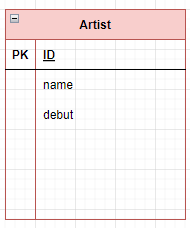

# ORM

- Object-Relational-Mapping
- 객체 지향 프로그래밍 언어를 사용하여 호환되지 않는 유형의 시스템 간의 데이터를 변환하는 프로그래밍 기술
- 파이썬에서는 SQLAlchemy, peewee 등 라이브러리가 있으며 Django 프레임워크 에서는 내장 Django ORM을 활용
- 특정 목적을 위해서 저장되어 관리되는 데이터의 집합을 DB라 하고 새로운 데이터 추가, 기존 데이터 조회를 도와주는 것이 DBMS라고 하는데 이를 관리하기 위한 언어가 SQL이다.

### 객체(object)로 DB를 조작

```sql
Genre.objects.all()
```

### 모델 설계 및 반영

1. 클래스를 생성하여 내가 원하는 DB의 구조를 만든다.
2. 클래스의 내용으로 데이터베이스에 반영하기 위한 마이그레이션 파일을 생성한다.
3. DB에 migrate 한다.

```sql
class Genre(models.Model):
	name = models.CharField(max_length=30)

```

```
$ python manage.py makemigrations
$ python manage.py migrate
```

### Migration(마이그레이션)

- Model에 생긴 변화를 DB에 반영하기 위한 방법
- 마이그레이션 파일을 만들어 DB 스키마를 반영한다.
- 명령어
  - makemigrations : 마이그레이션 파일 생성
  - migrate : 마이그레이션을 DB에 반영

```sql
BEGIN;
--
-- Create model Genre
--
CREATE TABLE "db_genre" (
	"id" integer NOT NULL PRIMARY KEY AUTOINCREMENT,
	"name" varchar(30) NOT NULL
);
COMMIT;

```

# ORM 기본 조작

### Create

```sql
# 1. create 메서드 활용
Genre.objects.create(name='발라드')

# 2. 인스턴스 조작
genre = Genre()
genre.name = '인디밴드'
genre.save()
```

### Read

```sql
# 1. 전체 데이터 조회
Genre.objects.all()
# <QuerySet [<Genre: Genre object (1)>, <Genre:
Genre object (2)>]>

# 2. 일부 데이터 조회(get)
Genre.objects.get(id=1)
# <Genre: Genre object (1)>

# 3. 일부 데이터 조회(filter)
Genre.objects.filter(id=1)
# <QuerySet [<Genre: Genre object (1)>]>
```

### Update

```sql
# 1. genre 객체 활용
genre = Genre.objects.get(id=1)

# 2. genre 객체 속성 변경
genre.name = '트로트’

# 3. genre 객체 저장
genre.save()
```

### Delete

```sql
# 1. genre 객체 활용
genre = Genre.objects.get(id=1)

# 2. genre 객체 삭제
genre.delete()
```

### Artist 모델 생성


