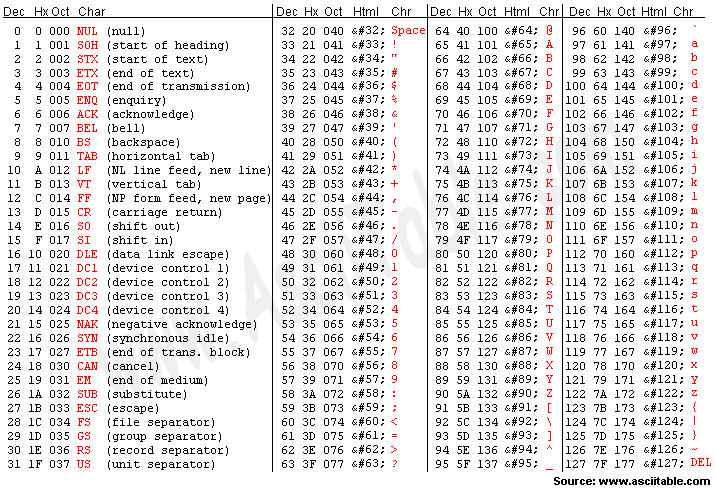

#  📌 문자열(String)

### 문자열은 immutable(변경 불가능한) 자료형 !

``` python
word = "apple"
print(word)
print(id(word))
>>> apple
>>> 1352749370800

word += " banana"
print(word)
print(id(word))
>>> apple banana
>>> 1352749417520

```


# 📌 문자열 슬라이싱

``s = ‘abcdefghi’``

- s[2:5] 🡪 ‘cde'
- s[-6:-2] 🡪 ‘defg’
- s[2:-4] 🡪 ‘cde’
- s[2:5:2] 🡪 ‘ce’
- s[-6: -1:3] 🡪 ‘dg’
- s[2:5:-1] 🡪 ‘ ’
- s[5:2:-1] 🡪 ‘fed’
- s[:3] 🡪 ‘abc’
- s[5:] 🡪 ‘fghi’
- s[:] 🡪 ‘abcdefghi'
- s[::-1] 🡪 ‘ihgfedcba’
- s[10:20] 🡪 ‘ ’

|       |  a   |  b   |  c   |  d   |  e   |  f   |  g   |  h   |  i   |
| :---: | :--: | :--: | :--: | :--: | :--: | :--: | :--: | :--: | :--: |
| index |  0   |  1   |  2   |  3   |  4   |  5   |  6   |  7   |  8   |
| indes |  -9  |  -8  |  -7  |  -6  |  -5  |  -4  |  -3  |  -2  |  -1  |


# 📌 문자열 메서드

###  1) .split(기준 문자)

- 문자열을 일정 기준으로 나누어 리스트로 반환
- 괄호 안에 아무것도 넣지 않으면 자동으로 공백을 기준으로 설정

```python
word = "I play the piano"

print(word.split())
# ['I', 'play', 'the', 'piano']
```


### 2) .strip(제거할 문자)

- 문자열의 양쪽 끝에 있는 특정 문자를 모두 제거한 새로운 문자열 반환
- 괄호 안에 아무것도 넣지 않으면 자동으로 공백을 제거 문자로 설정
- 제거할 문자를 여러 개 넣으면 해당하는 모든 문자들을 제거

```python
word = 'aHello Worlda'

print(word.strip("a"))

# Hello World
```


### 3) .find(찾는 문자)

- 특정 문자가 처음으로 나타나는 위치(인덱스)를 반환
- 찾는 문자가 없다면 -1을 반환

``` python
word = "apple"

print(word.find("p"))
# 1
-------------------------------------------
word = "apple"

print(word.find("k"))
# -1
```


### 4) .index(찾는 문자)

- 특정 문자가 처음으로 나타나는 위치(인덱스)를 반환
- 찾는 문자가 없다면 오류 발생

``` python
word = "apple"

print(word.index("p"))

# 1
```


### 5) .count(개수를 셀 문자)

- 문자열에서 특정 문자가 몇 개인지 반환
- 문자 뿐만 아니라, 문자열의 개수도 확인 가능

``` python
word = "banana"

print(word.count("a"))

# 3
```


### 6) .replace(기존 문자, 새로운 문자)

- 문자열에서 기존 문자를 새로운 문자로 수정한 새로운 문자열 반환
- 특정 문자를 빈 문자열("")로 수정하여 마치 해당 문자를 삭제한 것 같은 효과 가능

``` python
word = "happyhacking"

print(word.replace("happy", "angry"))

# angryhacking
```


### 7) 삽입할 문자.join(iterable)

- `iterable`의 각각 원소 사이에 특정 문자를 삽입한 새로운 문자열 반환
- 공백 출력, 콤마 출력 등 원하는 출력 형태를 위해 사용

``` python
word = "happyhacking"

print(" ".join(word))

# h a p p y h a c k i n g
```


# 📌 아스키(ASCII) 코드

```
컴퓨터는 숫자만 이해 할 수 있다. (0과 1 두가지 정보만 표현), 그렇다면 문자는 어떻게 저장될까?

→ ASCII (American Standard Code for Information Interchange) (미국 정보교환 표준부호)
```



### ✨ 아스키 코드란?

- 알파벳을 표현하는 대표 인코딩 방식
- 각 문자를 표현하는데 1byte(8bits) 사용
  - 1bit : 통신 에러 검출용
  - 7bit : 문자 정보 저장 (총 128개)


### 1) ord(문자)

- 문자 🡪 아스키코드로 변환하는 내장함수

``` python
print(ord("A"))
# 65

print(ord("a"))
# 97
```


### 2) chr(아스키코드)

- 아스키코드 🡪 문자로 변환하는 내장함수

``` python
print(chr(65))
# A

print(chr(97))
# a
```

