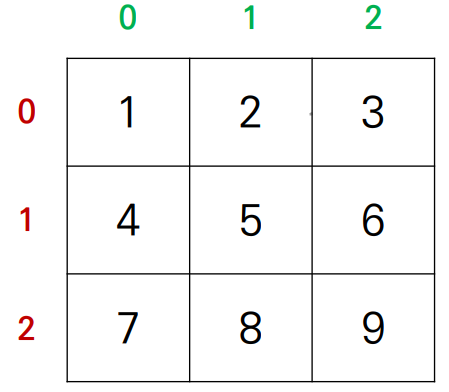

# 📌 이차원 리스트

- 이차원 리스트는 리스트를 원소로 가지는 리스트일 뿐이다.
- 이차원 리스트는 행렬(matrix)이다.

```python
matrix = [[1, 2, 3], [4, 5, 6], [7, 8, 9]]
```

```python
print(matrix[0])
>>> [1, 2, 3]

print(matrix[1])
>>> [4, 5, 6]

print(matrix[2])
>>> [7, 8, 9]
```

```python
print(matrix[0][0])
>>> 1

print(matrix[1][2])
>>> 6

print(matrix[2][0])
>>> 7
```

```python
matrix = [
    [1, 2, 3],
    [4, 5, 6],
    [7, 8, 9]
]
```

- 보기 좋게 변경하면 행렬(matrix)의 형태가 나온다




### ✔ 특정 값으로 초기화 된 이차원 리스트

1. 직접 작성(4 x 3 행렬)

```python
matrix1 = [[0, 0, 0], [0, 0, 0], [0, 0, 0].[0, 0, 0]]

matrix2 = [
    [0, 0, 0],
    [0, 0, 0],
    [0, 0, 0],
    [0, 0, 0]
]
```


	2. 반복문으로 작성(100x100 행렬)

```python
matrix = []

for _ in range(100):
    matrix.append([0] * 100)
    
print(matrix)
>>>  [[0, 0, 0], [0, 0, 0], [0, 0, 0], [0, 0, 0]]
```


	3. 리스트 컴프리헨션으로 작성 (n x m 행렬)

```python
n = 4 # 행
m = 3 # 열

matrix = [[0] * m for _ in range(n)]


print(matrix)
>>> [[0, 0, 0], [0, 0, 0], [0, 0, 0], [0, 0, 0]]
```


###  ❗ [주의] 리스트 컴프리헨션 vs 리스트 곱셈 연산

``` python
n = 4 # 행
m = 3 # 열

matrix1 = [[0] * m for _ in range(n)]
matrix2 = [[0] * m] * n

matrix1[0][0] = 1
matrix2[0][0] = 1

print(matrix1)
>>> [[0, 0, 0], [0, 0, 0], [0, 0, 0], [0, 0, 0]]
print(matrix2)
>>> [[1, 0, 0], [1, 0, 0], [1, 0, 0], [1, 0, 0]]
```


# 📌 입력 받기

- 행렬의 크기가 미리 주어지는 경우

```python
matrix = []

for _ in range(8):
	line = list(input())
	matrix.append(line)

# 리스트 컴프리헨션을 통해 이차원 리스트의 입력을 간단히 받을 수 있다.
matrix = [list(input()) for _ in range(8)]
```

```python
"""
n x m 크기의 입력을 받아보자.
3 4
1 2 3 4
5 6 7 8
9 0 1 2
"""

n, m = map(int, input().split()) # 3 4

matrix = [list(map(int, input().split())) for _ in range(n)]
```

