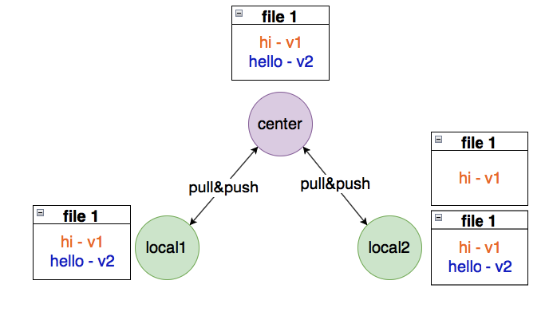

# ‼ 알아두면 나쁘진 않은것

CMD나 이런걸 CLI라고 함 

CLI = Command Line Interface

CLI <=> GUI

그동안은 GUI에 익숙하다면 CLI에 익숙해져라 CLI 명령어들을 읽어야한다

`내가 무엇인가 하려고 한다면 명령어를 읽고 결과를 도출`

`불편한 것이 아닌 전혀 다른것임을 알고 하자`

& 표시는 깃 베시 명령어 입력표시

# CLI 디렉토리 관리

- PWD ( print working directory) : 현재 디렉토리 출력
- cd(change directory) : 디렉토리 이동
  -  . : 현재 디렉토리,  .. : 상위 디렉토리
- ls (list) : 목록
- mkdir (make directory) : 디렉토리 생성 
- rm(Remove) : 파일 지우기
- rm -r : 폴더 지우기
- pwd : 현재 디렉토리 출력cd 디렉토리이름 : 디렉토리 이동 . : 현재 디렉토리, .. : 상위 디렉토리ls (list) : 목록 mkdir (make directory) : 디렉토리 생성 touch : 파일 생성 rm 파일명: 파일 삭제하기rm –r 폴더명 : 폴더 삭제하기

# 💨git/github

- git : 형상관리도구, 프로젝트 **버전관리**하는 소프트웨어 ------> **분산버전관리시스템**

- Markdown을 활용한 문서작성

- Markdown : 2004년 존 그루버가 만든 텍스트기반의 가벼운 마크업 언어 	ex) HTML(웹문서)  최초 마크다운에 비해 확장된 문법(표, 주석 등)이 있지만, 본 수업에선 github 에서 사용 가능한 문법

- typora : 마크다운 에디터 (편집기)

- 버전관리 예시로는 Google Document 버전관리가 있다.

# 💨Git

- 컴퓨터 파일의 변경사항을 추적하고 여러 명의 사용자들 간에 해당 파일들의 작업을 조율
- Git은 분산버전관리시스템으로 코드의 버전을 관리하는 도구
- 2005년 리눅스 커널을 위한 도구로 리누스 토르발스가 개발

​	

# 분산버전관리시스템(DVCS)

- 중앙집중식버전관리시스템은 중앙에서 버전을 관리하고 파일을 받아서 사용
- 분산버전관리시스템은 원격 저장소(remote repository)를 통하여 협업하고 모든 히스토리를 클라이언트들이 공유

Staging 단계가 있는 이유 : 버전으로 기록할 파일을 모으는 '임시공간' 

### ❗ git 기초 명령어

- git init
- git add
- git commit -m
- git status
- git log

####  1.저장소 처음 만들때

- git init

#### 2.버전을 기록할 때

- git add
- git commit -m '커밋메시지'

#### 3.상태 확인할 때

- git status : 1통 2통
- git log : 커밋 확인

### 💡 Git은 버전을 관리한다

### 💡 Git Hub도 버전을 관리한다

# Git 실습

- 깃 실습은 TIL 저장소에 올린 파일과 TEST 저장소에 올린 파일 입니다. [test](https://github.com/hady1024/test)

