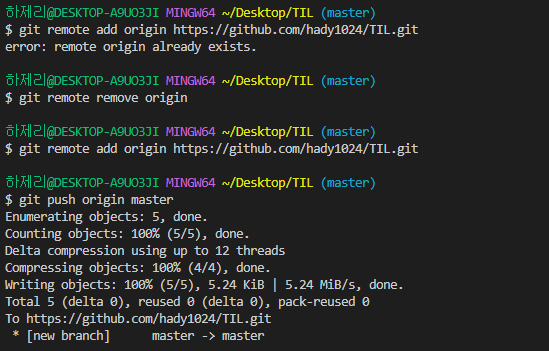

# ‼ 알아두면 나쁘진 않은것

CMD나 이런걸 CLI라고 함 

CLI = Command Line Interface

CLI <=> GUI

그동안은 GUI에 익숙하다면 CLI에 익숙해져라 CLI 명령어들을 읽어야한다

`내가 무엇인가 하려고 한다면 명령어를 읽고 결과를 도출`

`불편한 것이 아닌 전혀 다른것임을 알고 하자`

& 표시는 깃 베시 명령어 입력표시

# CLI 디렉토리 관리

- PWD ( print working directory) : 현재 디렉토리 출력
- cd(change directory) : 디렉토리 이동
  -  . : 현재 디렉토리,  .. : 상위 디렉토리
- ls (list) : 목록
- mkdir (make directory) : 디렉토리 생성 
- rm(Remove) : 파일 지우기
- rm -r : 폴더 지우기
- pwd : 현재 디렉토리 출력cd 디렉토리이름 : 디렉토리 이동 . : 현재 디렉토리, .. : 상위 디렉토리ls (list) : 목록 mkdir (make directory) : 디렉토리 생성 touch : 파일 생성 rm 파일명: 파일 삭제하기rm –r 폴더명 : 폴더 삭제하기

# 💨git/github

- git : 형상관리도구, 프로젝트 **버전관리**하는 소프트웨어 ------> **분산버전관리시스템**

- Markdown을 활용한 문서작성

- Markdown : 2004년 존 그루버가 만든 텍스트기반의 가벼운 마크업 언어 	ex) HTML(웹문서)  최초 마크다운에 비해 확장된 문법(표, 주석 등)이 있지만, 본 수업에선 github 에서 사용 가능한 문법

- typora : 마크다운 에디터 (편집기)

- 버전관리 예시로는 Google Document 버전관리가 있다.

# 💨Git

- 컴퓨터 파일의 변경사항을 추적하고 여러 명의 사용자들 간에 해당 파일들의 작업을 조율
- Git은 분산버전관리시스템으로 코드의 버전을 관리하는 도구
- 2005년 리눅스 커널을 위한 도구로 리누스 토르발스가 개발

​	

# 분산버전관리시스템(DVCS)

- 중앙집중식버전관리시스템은 중앙에서 버전을 관리하고 파일을 받아서 사용
- 분산버전관리시스템은 원격 저장소(remote repository)를 통하여 협업하고 모든 히스토리를 클라이언트들이 공유

Staging 단계가 있는 이유 : 버전으로 기록할 파일을 모으는 '임시공간' 

### ❗ git 기초 명령어

- git init
- git add
- git commit -m
- git status
- git log

####  1.저장소 처음 만들때

- git init

#### 2.버전을 기록할 때

- git add
- git commit -m '커밋메시지'

#### 3.상태 확인할 때

- git status : 1통 2통
- git log : 커밋 확인

### 💡 Git은 버전을 관리한다

### 💡 Git Hub도 버전을 관리한다

# 원격저장소 (Remote Repository) 기본 흐름

- 로컬 저장소의 버전을 원격저장소로 보낸다
- 로컬 저장소의 버전(커밋)을 원격저장소로 보낸다 (git push)
- 원격저장소의 버전(커밋)을 로컬 저장소로 가져온다 (git pull)

#### 원격저장소를 만들고 로컬저장소의 커밋을 push한다. *(로컬저장소에 원격 저장소 정보는 필수!)*

# Git 실습

- 깃 실습은 TIL 저장소에 올린 파일과 TEST 저장소에 올린 파일 입니다. [test](https://github.com/hady1024/test)
- GitHub에서 저장소 만들기 실습

​		1. 

2.

3. git remote add origin https://github.com/hady1024/TIL.git 입력
   - remote : 원격저장소 
   - add : 추가
   - origin : origin 으로
   - 깃허브 주소뒤에는 깃허브 **유저네임**과 **저장소 이름**을 입력하는것
4. git push origin master를 입력하여 자료 올림

# 원격저장소 설정 기본 명령어

| 명령어                            | 내용                                     |
| :-------------------------------- | :--------------------------------------- |
| git clone <url>                   | 원격저장소 복제                          |
| git remote -v                     | 원격저장소 정보 확인                     |
| git remote add <원격저장소> <url> | 원격저장소 추가 (일반적으로 origin) |
| git remote rm <원격저장소>        | 원격저장소 삭제                          |
| git push <원격저장소> <브랜치>    | 원격저장소에 push                        |
| git pull <원격저장소 <브랜치>     | 원격저장소로부터 pull                    |

# .gitignore

- 일반적인 개발 프로젝트에서 버전 관리를 별도로 하지 않는 파일/디렉토리가 발생한다.
- Git 저장소에 .gitignore 파일을 생성하고 해당 내용을 관리한다.
- **작성예시**
  - 특정 파일 : a.txt (모든 a.txt), test/a.txt (테스트 폴더의 a.txt)
  - 특정 디렉토리 : /my_secret
  - 특정 확장자 : *.exe
  - 예외 처리 : !b.exe
- ❗❗❗❗ **주의** 이미 커밋된 파일은 반드시 삭제를 하여야 .gitignore로 적용이 됨
  - 🔎🔎프로젝트 시작전에 미리 설정해야함!! 

## 220706 개인적으로 오늘 힘들었던 점 

😂 깃허브 저장소 만들기 실습을 하는도중 push가 안되는 일이 있었다.. 그래서 pull을 입력하여 다시 해봤지만 

​	  똑같았다.. 

 

 

해결방법을 검색해본 결과 **git remote remove origin**을 입력하여 저장소와 연결을 삭제하는 것이라고 나왔다

그러나 **git remote remove origin** 입력 후에도 계속 반복되는 오류로 살짝 흔들렸지만 깃허브 저장소도 지우고 저장소 연결 삭제 다시 해보고 저장소 새로 만들고 push를 하니 깃허브에 파일이 올라갔다🤣🤣👍👍

 

