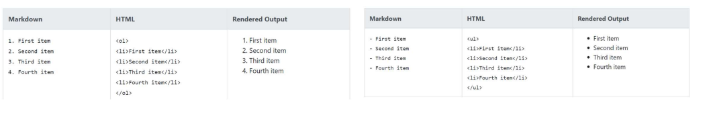

# 마크다운 특징

- 워드는 다양한 서식과 구조를 지원, 문서에 즉각적으로 반영
- 마크다운은 가능한 읽을 수 있도록 최소한의 문법으로 구조화 (make it as readable as possible)

- 마크다운은 단순한 텍스트 문법으로 내용을 작성, 다양한 환경에서 변환하여 보여줌
  - 다양한 text editor, 웹 환경에서 모두 지원

# 마크다운 문법 - Heading

- Heading은 문서의 제목이나 소제목으로 사용
  - #의 개수에 따라 대응되는 수준(Heading Level)이 있으며, h1 ~h6까지 표현 가능
  - 문서의 구조를 위해 작성되며 글자 크기를 조절하기 위해 사용되어서는 안됨 
  - (문단의 구성을 위한 사용이지 이쁘게 만들거나 글자 크기를 내 맘대로 설정하려고 하면 망함.)


# 마크다운 문법 - List

### 순서가 없는 리스트 : - (hypen), *(asterisk)

목록 활용시 단계를 tab과 shift + tab으로 조절한다


- List는 순서가 있는 리스트(Ol)와 순서가 없는 리스트(ul)로 구성




# Fenced Code Block 코드블록

-  (backtick) 기호 3개를 활용하여 작성 (``` 숫자키1옆에 문자```)
-  코드 블록에 특정언어를 명시하면 Syntax Highlighting 적용가능

```python
print('hello')
#주석
```

```html
print('hello')
# 주석
<h1>
    하이염
</h1>
<!-- 주석 -->
```

- 파이썬에서 하던걸 그대로 가져올 수 있음 , HTML도 동일함!!!👍👍

## Inline block down

`print` 는 파이썬에서 출력하는 함수이다.

## 링크

[살라버스링크](https://syllaverse.com/courses/3)


## 인용문

- \>를 통해 인용문을 작성

> Life is short, you need python.


dd

## 마크다운 문법 -Table (표)

타이포라 기능을 적극 활용하자

본문> 표> 삽입 (ctrl + T)

| 이름 | 댓글        |
| ---- | ----------- |
| ㅇㅇ | 신기방기    |
| ㅇㅇ | 신기방기 22 |


## 텍스트

**굵게(볼드체)** : `**`

*기울림(이탤릭체)*: `*`

~~취소선~~ : `~`

내가 해본거 : **아직은** *뭐가 뭔지 모르지만*  **열심히** 하면 나도 잘 할수 있겠지?? 화이팅!!***

## 수평선

- 3개 이상의 asterisks (***), dashes (---), or underscores (___)

`---`


## ✔기타정리

띄어 쓰기 있는 것 

- 제목(`#`)
- 목록(`-`, `1.`)

띄어 쓰기 없는 것

`inline code block` *기울임* **굵게**